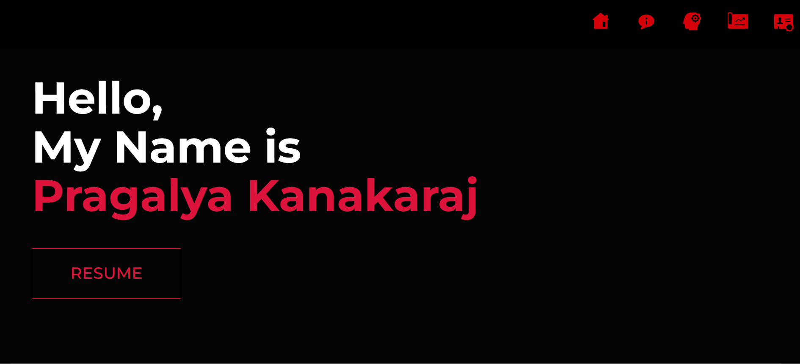
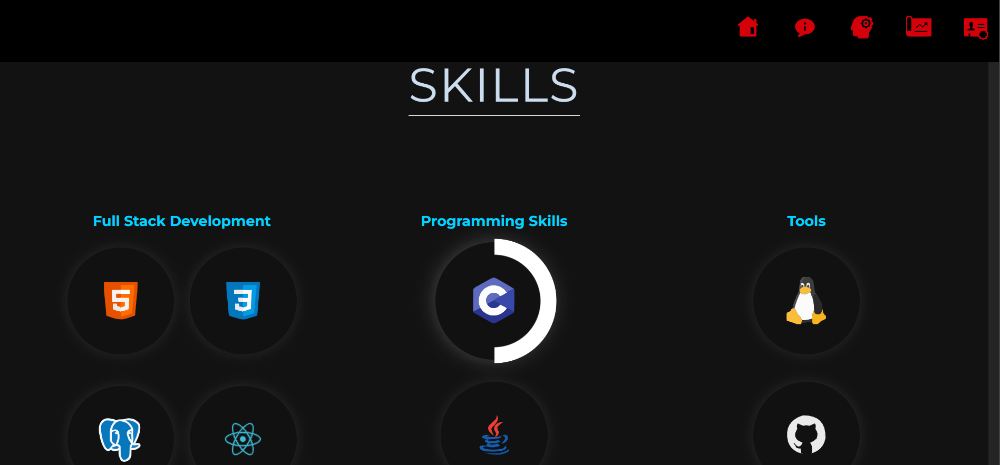
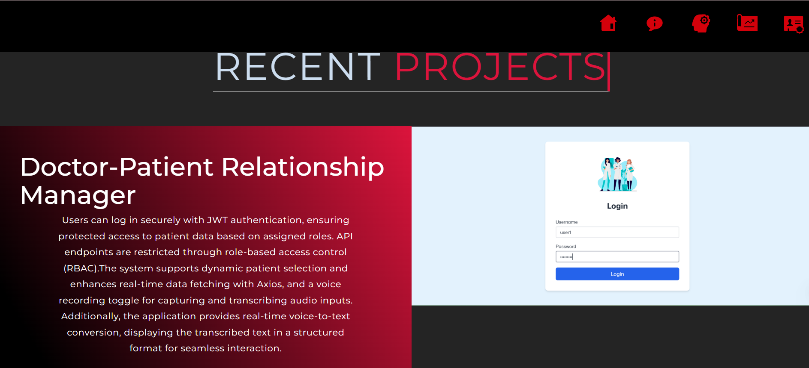

## 🚀 Pragalya Kanakaraj - Portfolio

🎨 **Welcome to my portfolio!** This is a showcase of my skills, projects, and expertise in **Full-Stack Development**, featuring a sleek UI, seamless functionality, and interactive components.  



---

## 📌 **About Me**
👋 Hi, I’m **Pragalya Kanakaraj**, a passionate **Full-Stack Developer** with expertise in **React.js, Golang, PostgreSQL, and TailwindCSS**. I love building **scalable web applications** with a strong focus on performance and user experience.

---

## 🛠 **Tech Stack & Skills**  
✨ My portfolio highlights my experience with the following technologies:

### **🚀 Frontend**
- ⚛️ **React.js**  
- 🎨 **TailwindCSS & CSS3**  
- 📜 **JavaScript (ES6+)**  

### **🛠 Backend**
- 🔥 **Golang (without ORM)**  
- 🗄 **PostgreSQL (Database Management)**  
- 🔐 **JWT Authentication & Role-Based Access Control**  

### **⚡Tools**
- 🐧 **Linux**  
- 🔄 **Git & GitHub**   



---

## 🚀 **Projects**
### 📌 **1. Faculty Monitoring Portal**
🔹 **Tech Stack:** React.js, Golang, PostgreSQL  
🔹 **Features:**  
✅ Real-time tracking of faculty progress and allows Board chairman to allocate📊  
✅ Optimized UI/UX for easy monitoring 🎨  

### 📌 **2. Doctor-Patient Relation Manager**
🔹 **Tech Stack:** React.js, Golang, PostgreSQL, Speech-to-Text  
🔹 **Features:**  
✅ Live doctor-patient conversation transcription 🏥  
✅ Implemented secure JWT-based authentication with role-based access control🔐   

 
 
---
## 📂 **Project Structure**
```sh
Pragalya_K-Portfolio/
│── public/             # Static assets (Images, Resume, etc.)
│── src/                # Source code
│   ├── components/     # Reusable UI components
│   ├── pages/          # Individual pages
│   ├── assets/         # Icons, images, etc.
│   ├── App.jsx         # Main application file
│── vite.config.js      # Vite configuration
│── README.md           # 📌 You are here!
```

---

## 🚀 **How to Run Locally**
📌 Clone the repository  
```sh
git clone https://pragal15.github.io/Pragalya_K-Portfolio/
```
📌 Navigate to the folder  
```sh
cd technical_portfolio
```
📌 Install dependencies  
```sh
npm install
```
📌 Start the development server  
```sh
npm run dev
```
---

## 📦 **Deployment**
🚀 **Deployed on:** Github  
🌍 **Live URL:** [Visit My Portfolio](https://github.com/PragaL15/Pragalya_K-Portfolio)

---

## 📫 **Let's Connect!**
💼 [LinkedIn](https://www.linkedin.com/in/pragalya-kanakaraj)  
📌 [GitHub](https://github.com/PragaL15/)  

---

🎉 **Thanks for visiting my portfolio!** If you like my work, don't forget to ⭐ the repo! 😊🚀
```
